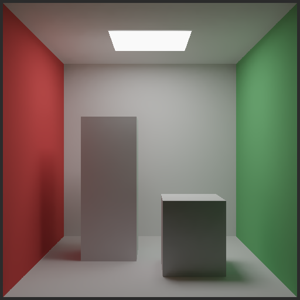

# 54-cornellbox

The classic **Cornell Box**, path traced in a **Slang** shader — with real global
illumination (colour bleeding, soft shadows) via progressive Monte Carlo accumulation.

Four **render stages** (selectable in the UI) show the evolution from ray tracing to
denoised real-time path tracing:

1. **Simple RT** — deterministic direct lighting (light centre + hard shadow + ambient).
   Noise-free baseline; what "ray tracing works" looks like.
2. **Simple PT** — the progressive path tracer. Converges when still; raw 1 sample/pixel
   noise while the boxes rotate.
3. **PT + SVGF denoiser** — the same path tracer plus the full SVGF pipeline: temporal
   reprojection with validated bilinear history and variance clamping, then 4 edge-aware
   à-trous wavelet passes whose filter width is guided by a temporally-accumulated
   per-pixel variance estimate (plus normal/depth edge-stopping from a primary-hit
   G-buffer). 1 sample/pixel becomes a clean image in motion, and a converged image stays
   sharp because the filter shuts off where variance is low. Directly-visible emission
   (the light itself) is composited from the G-buffer *after* filtering — its raw radiance
   would otherwise dominate the variance at the emitter's edges and make the filter smear
   it into the ceiling.
4. **PT + ReSTIR DI + denoiser** — stage 3 with the primary-vertex direct lighting
   resampled by ReSTIR: 8 fresh area-light candidates merged with the reprojected
   previous-frame reservoirs of this pixel and two neighbours (spatiotemporal reuse,
   M-clamped), one visibility ray for the selected sample. With a single area light the
   win is modest (cleaner soft shadows); the algorithm is the point — with many lights it
   becomes decisive.
5. **RT pipeline (hit shaders)** — the stage-1 image computed through the ray-tracing
   *pipeline*: per-material shading in a closest-hit shader, shadow ray to miss index 1
   with an any-hit stage that lets the shadow ray pass through emitters, the rotation angle
   passed via the ray payload. Needs `BGFX_CAPS_RAY_TRACING_PIPELINE`. Verified against the
   ray-query stage by `tools/rt-validation/rt_pipeline_cornellbox`: bit-exact on Vulkan
   (RTX 4090 and lavapipe), and within ~80 edge pixels of 65536 on D3D12, where `RayQuery`
   and `TraceRay` tie-break grazing rays differently — deterministically, since an RTX 4090
   and WARP produce identical output.

Two rendering paths share the scene and all three stages (the estimator: next-event
estimation toward the ceiling area light + cosine-weighted diffuse bounces), selected at
runtime:

- **RT accelerated** (`cs_cornellbox_rq.slang`) — the scene as three BLASes (walls+light,
  tall box, short box) instanced by a TLAS built through the bgfx acceleration-structure
  API (`createBlas` / `createTlas` / `updateTlas` / `setAccelerationStructure`), traced
  with hardware **ray query**. Selected when `BGFX_CAPS_RAY_TRACING` is present.
  Per-triangle materials live in a buffer indexed by `instance*12 + primitive`.
- **Compute fallback** (`cs_cornellbox.slang`) — a self-contained analytic path tracer.
  Runs anywhere `BGFX_CAPS_COMPUTE` is available; this is what the example drops to when
  the RT cap is absent. Renders the same image.

**Press Space** (or use the checkbox) to toggle the **rotation mode**: the two boxes spin
about their own axes — the RT path animates them by rewriting the TLAS instance transforms
with `bgfx::updateTlas` every frame, the fallback by transforming rays into the boxes'
local frames. While the boxes move, every frame is a fresh 1-sample/pixel image (real-time
path tracing); when they stop, the accumulation converges again.

## Why Slang

The shaders are authored once in Slang and compiled through bgfx's Slang front-end to every
backend: SPIR-V for Vulkan and, via SPIRV-Cross, MSL for Metal — including the ray-query
path (`RayQuery` / `metal::raytracing::intersection_query`). This example is the first
end-to-end render driven by that path, and the ray-query variant is the first hardware ray
trace through the bgfx acceleration-structure runtime.

## Files

- `cs_cornellbox_rq.slang` — the hardware ray-query path tracer (TLAS + material buffer).
- `cs_cornellbox.slang` — the analytic compute-fallback tracer (same stages).
- `cornellbox.sh.slang` — shared module: scene constants (camera, light, box placement)
  and the math helpers, imported by every pass (single source of truth).
- `cs_cornellbox_temporal.slang` — the temporal reprojection pass (backend-independent).
- `cs_cornellbox_atrous.slang` — the edge-aware à-trous filter pass (backend-independent:
  it denoises the output of either tracer).
- `rt_cornellbox_{rg,chit,miss,shadow,ahit}.slang` — the RT-pipeline stage (stage 5):
  ray generation, closest hit, radiance miss (index 0), shadow miss (index 1) and the
  any-hit that stops emitters from shadowing. These have no `shader.mk` rule — the
  makefile only globs `vs_`/`fs_`/`cs_`, so they are compiled explicitly (stage from each
  shader's `[shader(...)]` attribute; `-p spirv` for Vulkan, `-p s_6_5` for DXIL).
  **`rt_cornellbox_ahit` has no Metal binary yet and `rt_cornellbox_chit` changed when
  any-hit was added** — both need a regeneration pass on macOS before stage 5 runs there.
- `vs_cornellbox.slang` / `fs_cornellbox.slang` — a fullscreen quad that presents the image.
- `cornellbox.cpp` — the app: builds the meshes + BLAS/TLAS when `BGFX_CAPS_RAY_TRACING`
  is present, drives the accumulation/rotation state, dispatches whichever tracer applies.
- `makefile` — builds the Slang shaders for Metal + SPIR-V (`SHADER_TARGETS := 5 7`).

## Status

- Both paths verified on Metal (Apple GPU): the ray-query and analytic path tracers render
  the same image, static and rotated (the screenshot is the ray-query path, stage 4:
  ReSTIR + SVGF, converged).
- Vulkan compiles end-to-end (SPIR-V ray query + the VK acceleration-structure backend) but
  awaits validation on a Vulkan host with `VK_KHR_ray_query` hardware.

## Notes / lessons learned here

- bgfx flattens the `t`/`u` register spaces into one bind namespace — resources need
  globally unique register numbers or they collapse onto the same bind stage
  (`scene : t0`, `s_accum : u1`, `s_target : u2`, `materials : u3`).
- Inline ray query only auto-commits **opaque** geometry; the runtime marks BLAS geometry
  opaque on both backends.
- Don't name a ray-query local `ray` — it collides with MSL's `metal::raytracing::ray`
  type in SPIRV-Cross output.
- BLAS-local material normals must be rotated by the instance rotation in the shader (the
  same `bx::mtxRotateY` convention: `x' = c·x − s·z`, `z' = s·x + c·z`).
- The accumulation image is an `RGBA32F` read-write image (`Access::ReadWrite`); the
  running average is tonemapped (Reinhard + gamma) into the RGBA8 display image each frame.
